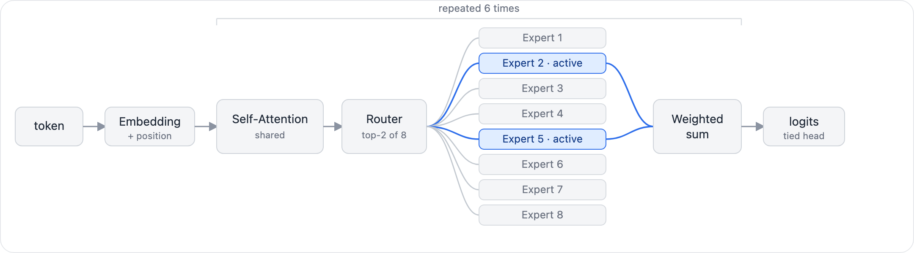
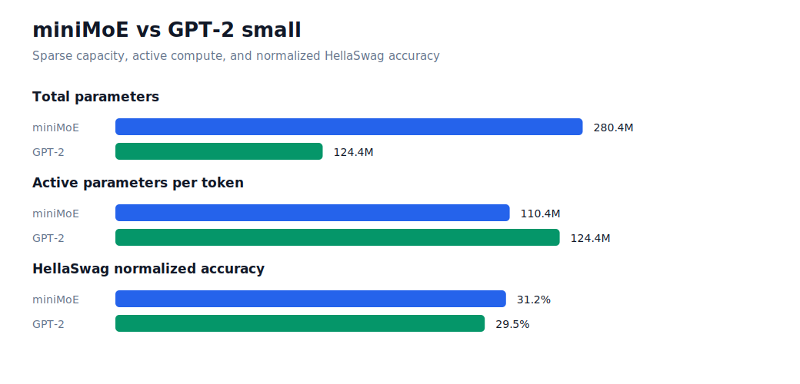

# miniMoE

A 280M-parameter sparse Mixture-of-Experts language model, pretrained from scratch on 10B tokens and instruction-tuned for chat.

**[Weights on Hugging Face](https://huggingface.co/mokner123/miniMoE)**



Every feed-forward block holds 8 experts; each token routes to only 2.
The model carries 280M parameters but spends 110M per token.
It was pretrained on FineWeb-Edu web text, then fine-tuned on `smol-smoltalk` to follow instructions instead of only continuing text.

## Architecture

| Item | Value |
|---|---:|
| Total parameters | 280.4M |
| Active parameters per token | 110.4M |
| Transformer blocks | 6 |
| Hidden size | 768 |
| Attention heads | 8 |
| Experts per block | 8, top-2 active |
| Expert MLP hidden size | 3,072 |
| Context length | 1,024 |
| Vocabulary | 50,304 GPT-2 BPE |

## Training

| Stage | Data | Steps | Peak LR | Hardware |
|---|---|---:|---:|---|
| Pretrain | FineWeb-Edu, 10B tokens | 19,073 | `6e-4` | 8 GPU, DDP |
| Instruction tune | smol-smoltalk, 2 epochs | 6,358 | `2e-5` | 2x A100, DDP |

Both stages use AdamW with cosine decay, bf16 autocast with an fp32 router, and `torch.compile`.

## Results

| Metric | Value |
|---|---:|
| Pretrain validation loss | 3.04 |
| SFT validation loss | 1.89 → 1.54 |
| HellaSwag `acc_norm` probe | 35% |



SFT loss is on chat data and not comparable to the pretraining loss.
HellaSwag is a 32-example in-training probe, not a full benchmark.

## Run

```bash
pip install -r requirements.txt

python src/sample.py -c minimoe_step_0019073.pt -p "Sparse expert models"   # base, completion
python src/sample.py -c minimoe_sft.pt --sft                                # tuned, chat
```

Train from scratch:

```bash
python src/fineweb.py && torchrun --standalone --nproc_per_node=8 src/train.py                              # pretrain
python src/sft_data.py && EPOCHS=2 BATCH_SIZE=64 GRAD_ACCUM_STEPS=1 torchrun --standalone --nproc_per_node=2 src/sft_train.py  # SFT
```

## Files

| File | Role |
|---|---|
| `src/model.py` | MoE transformer, router, generation |
| `src/train.py` | pretraining loop |
| `src/sft_train.py` | instruction-tuning loop |
| `src/sft_data.py`, `src/chat_template.py` | chat data prep and shared chat format |
| `src/fineweb.py` | FineWeb-Edu tokenization |
| `src/hellaswag.py` | HellaSwag evaluation |
| `src/sample.py` | sampling, base completion and `--sft` chat |
| `assets/`, `scripts/` | diagrams and the SFT runbook |
