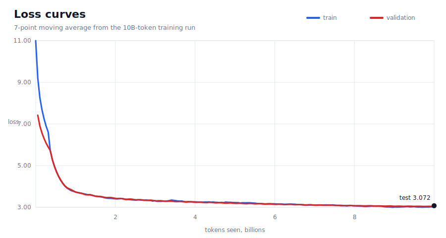
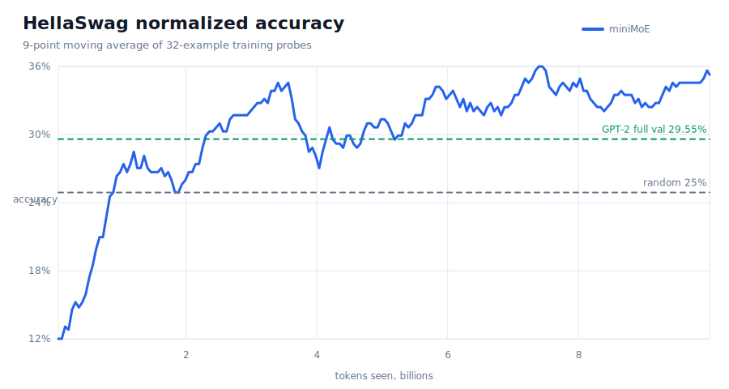
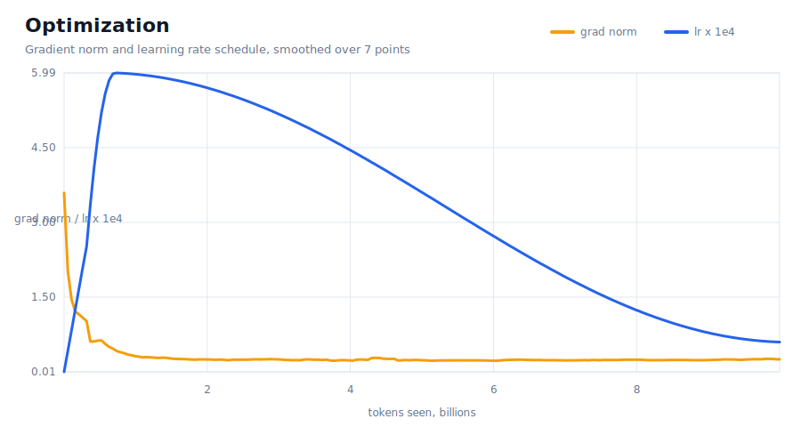

# miniMoE

miniMoE is a sparse GPT-style language model trained from scratch on 10B FineWeb-Edu tokens.
I built it to test a compact Mixture-of-Experts design where most of the model capacity lives in expert MLPs, while each token only activates a small compute path.

## Method

The model keeps a GPT-style causal transformer backbone and replaces every dense feed-forward block with an 8-expert top-2 MoE layer.
Attention, embeddings, layer norms, the router, and the tied output head are shared.
For each token, the router scores all 8 experts, selects 2, and mixes their outputs with a softmax over the selected routing logits.

I trained the router in fp32 under bf16 autocast because routing decisions were the most numerically sensitive part of the model.
I also added a Switch-style load-balancing auxiliary loss with coefficient `0.01` so the router would use the experts instead of collapsing onto a small subset.

## Architecture

| Item | Value |
|---|---:|
| Context length | 1,024 |
| Vocabulary | 50,304 GPT-2 BPE tokens |
| Transformer blocks | 6 |
| Hidden size | 768 |
| Attention heads | 8 |
| Experts per block | 8 |
| Active experts per token | 2 |
| Expert MLP hidden size | 3,072 |
| Total parameters | 280.4M |
| Active parameters per token | 110.4M |

Parameter split:

| Bucket | Params |
|---|---:|
| Shared parameters | 53.7M |
| Expert parameters | 226.7M |
| Active expert parameters per token | 56.7M |

## Training

Training data came from `HuggingFaceFW/fineweb-edu` using the `sample-10BT` split.
`fineweb.py` tokenizes with the GPT-2 tokenizer, writes 100M-token NumPy shards, reserves 50M tokens for validation, reserves 50M tokens for test, and uses the rest for training.

| Setting | Value |
|---|---:|
| Optimizer | AdamW |
| Betas | `(0.9, 0.95)` |
| Weight decay | `0.1` |
| Tokens per optimizer step | 524,288 |
| Steps | 19,073 |
| Tokens trained | 9,999,745,024 |
| Peak LR | `6e-4` |
| Final LR | `6e-5` |
| Warmup | 715 steps |
| Precision | bf16 autocast, fp32 router |
| Runtime | DDP, `torch.compile` |

## Results

The final checkpoint is `minimoe_step_0019073.pt`.
These numbers come from the completed training log.

| Metric | miniMoE |
|---|---:|
| Train loss | 3.0869 |
| Validation loss | 3.0409 |
| Test loss | 3.0725 |
| HellaSwag normalized accuracy (`acc_norm`) probe | 31.25% |
| Last-10 HellaSwag normalized accuracy mean | 35.00% |

The HellaSwag value is a 32-example training probe, so it is a smoke test rather than a full benchmark.
The GPT-2 comparison uses the full validation result documented in `hellaswag.py` with the same completion-style scoring method.








## Reproduce

```bash
pip install -r requirements.txt
python fineweb.py
torchrun --standalone --nproc_per_node=8 train.py
```

Single-GPU training also works:

```bash
python train.py
```

Sample from the trained checkpoint:

```bash
python sample.py -c minimoe_step_0019073.pt -p "Sparse expert language models"
```

Regenerate the figures:

```bash
python scripts/plot_metrics.py --log train_log.csv --out-dir assets
```

## Code Map

| File | Role |
|---|---|
| `model.py` | MoE transformer, router, generation, optimizer setup |
| `train.py` | DDP training loop, validation, HellaSwag probes, checkpoints, CSV logging |
| `fineweb.py` | FineWeb-Edu tokenization and shard creation |
| `hellaswag.py` | HellaSwag rendering and GPT-2 baseline evaluation |
| `sample.py` | checkpoint loading and sampling |
| `scripts/plot_metrics.py` | SVG figures from `train_log.csv` |
